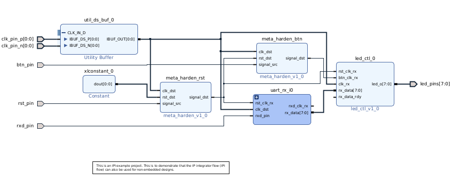

# Lab 7 - Creating Custom IP

## Introduction

Lab 7 is about creating and using custom IPs in the block diagram designer. In part 1 and 2, an instruction pdf contained the instructions for creating the block designs in Vivado. For part 3 and 4, block design was created and the custom VHDL code was added to the IP. The custom generated IP was added to a block design in Vivado and then the firmware was exported to Vitis. Part 3 is a multiplier IP and part 4 is a IP to control the LEDs on the Zybo. 

## Prodecure

### Part 1
Part 1 demonstrated how to create an IP integrator block diagram with the following IPs:
1. uart_baud_gen 
2. uart_rx_ctl 
3. meta_harden x3
4. utility buffer
5. led_ctl 

External ports were created for the IPs to connect to the led_ctl_0 IP. The ports were connected according to the specifications in the instructions. Lastly, the IP output products were generated. 

  
**Figure 7.1:** Part 1, Block Design

### Part 2

Part 2 was based off of a .xpr Vivado project file that was provided. The first step was to set the UART io as the top level in the hierachy to specify that it was going to be used for the IP generation. The next steps were based around configuring the IP in the build options with the following steps:

1. IP Identification
2. FPGA family specification
3. Remove unnecesary constraint and simulation files
4. Specify the custom parameters
5. Specify the ports
6. Specify the interfaces
7. Pair the port mappings in the block design interface to the verilog code
8. Generate IP

Once the IP was created, it was imported to the same Vivado project. Code was copied from the instantion template of the IP, "uart_tx_0.veo" to the wave_gen.v project file to replace the existing UART instantiation, such as in figure 7.2. 

  
**Figure 7.2:** Part 2, Code Replacement from IP

The custom IP was also added to a block design and connected to a fifo_generator IP, such as in figure 7.3.

  

**Figure 7.3:** Part 2, Use of created IP in block design

### Part 3
A custom IP was created to multiply two 16 bit numbers to a 32 bit output register. The two 16 bit numbers were obtained from the PS placing them in the memory address of the IP. The IP fed the two numbers into multipier statement in VHDL. The multiplier output was written to the second register of the IP and then displayed on the PS console output. 

   
**Figure 7.4:** Part 3, Use of custom multiplier IP in block design

### Part 4
A custom IP was created to control the 4 LEDs on the Zybo from the PS of the ZYNQ. The custom IP was created with VHDL code. The first four bits of slave_reg0 were mapped to the four LEDs. When the PS wrote a number to the memory address of slave_reg0, the LEDs turned on according to the number (0-15). In the instance that a number were entered on the console that is larger than 15, the LEDs displayed the least significant bits of that number. 

  
**Figure 7.5:** Part 4, Use of custom num2led IP in block design

## Results

### Part 3
Results for part 3 [here](https://youtu.be/HI5FxRw1tgg)

### Part 4
Results for part 4 [here](https://youtu.be/k70NFlfXFJQ)

## Conclusion
I was intimidated at first to create my own custom IP. Using the knowledge I learned about VHDL in ECE 420 and ECE 524, I was able to implement part 4 on the first try after I understood how the VHDL code works in the IP format. This lab made me more excited about using SoC platforms and it was cool to see the LEDs react to the user input. 
